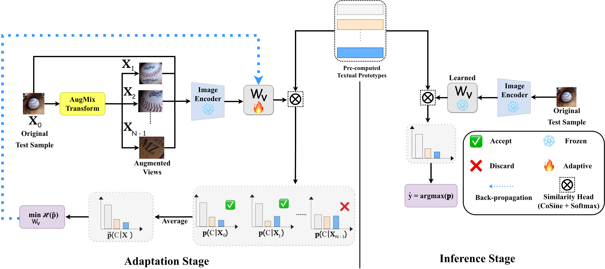
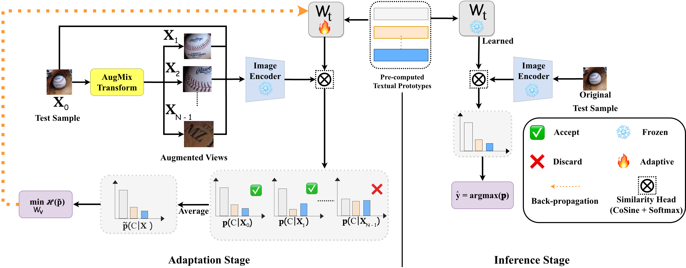

# IMA & TMA: Efficient Test-Time Adaptation for VLMs via Linear Transformation in Embedding-Space

This repo provides the source code of our approach that was accepted in CVPR'26 ViScale workshop.

## Abstract
Large-scale Vision-Language Models (VLMs) have set new benchmarks in zero-shot learning; however, their performance remains brittle under distribution shifts at test time.
While existing Test-Time Adaptation (TTA) methods often rely on prompt tuning or input-space optimization, they incur significant computational overhead and scale poorly with class cardinality.
To bridge this gap, we propose two lightweight, sample-wise alignment strategies: Image Matrix Adapter (IMA) and Text Matrix Adapter (TMA).
Unlike previous methods, IMA and TMA apply linear corrections directly in the embedding space, thereby restoring cross-modal alignment with a single test sample.
This approach drastically reduces memory and computational requirements, as the adaptation cost remains independent of the number of target classes. 
Extensive evaluations across diverse out-of-distribution (OOD) benchmarks and cross-dataset scenarios demonstrate that our methods achieve competitive accuracy while being significantly more efficient than state-of-the-art prompt-based adaptation, making them ideal for resource-constrained deployment.

## Methodology
### IMA : Image Matrix Adapter

### TMA : Text Matrix Adapter

## Prerequisites
### Hardware
Experiments were conducted on a remote GPU server with the following configuration:

- GPUs: 8 × NVIDIA Tesla V100-SXM2 (32 GB VRAM each)
- CUDA Version: 12.2
- Platform: Linux-based system

#### Resource Usage
- GPU memory used per experiment: ~1.5–2 GB 
- Adaptation-specific memory usage: ~0.72 GB

### Software Environment
Experiments were conducted using the following software setup:

- OS: Linux (Ubuntu-based)
- Python: 3.7.12

## Datasets
We use the following datasets for our experiments.

5 ImageNet variants under Natural Distribution shifts
- [ImageNet](https://image-net.org/index.php)
- [ImageNet-A](https://github.com/hendrycks/natural-adv-examples)
- [ImageNet-V2](https://s3-us-west-2.amazonaws.com/imagenetv2public/imagenetv2-matched-frequency.tar.gz)
- [ImageNet-R](https://github.com/hendrycks/imagenet-r)
- [ImageNet-Sketch](https://github.com/HaohanWang/ImageNet-Sketch)

10 Finegrained classification benchamrks for cross-dataset generalization
- [CalTech](https://www.vision.caltech.edu/Image_Datasets/Caltech101/101_ObjectCategories.tar.gz)
- [OxfordPets](https://www.robots.ox.ac.uk/~vgg/data/pets/data/images.tar.gz)
- [StanfordCars](https://huggingface.co/datasets/tanganke/stanford_cars)
- [Flower102](https://www.robots.ox.ac.uk/~vgg/data/flowers/102/102flowers.tgz)
- [Food101](http://data.vision.ee.ethz.ch/cvl/food-101.tar.gz)
- [Aircraft](https://www.robots.ox.ac.uk/~vgg/data/fgvc-aircraft/archives/fgvc-aircraft-2013b.tar.gz)
- [SUN397](https://huggingface.co/datasets/1aurent/SUN397)
- [DTD](https://www.robots.ox.ac.uk/~vgg/data/dtd/download/dtd-r1.0.1.tar.gz)
- [EuroSAT](http://madm.dfki.de/files/sentinel/EuroSAT.zip)
- [UCF101](https://drive.google.com/file/d/10Jqome3vtUA2keJkNanAiFpgbyC9Hc2O/view?usp=sharing)
